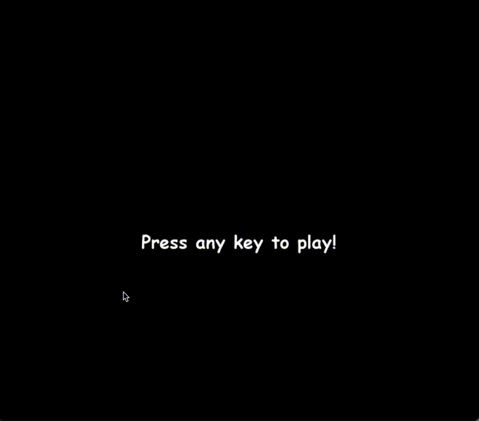

# Tetris Game

<div align="center">
  
  [](#overview)
  [](#aperçu)

</div>

---

## Overview
Welcome to the Tetris game project! This project aims to recreate the classic Tetris game using Python. Tetris is a tile-matching puzzle game originally designed and programmed by Alexey Pajitnov. The goal of the game is to manipulate tetrominoes to create horizontal lines of blocks without gaps. When such a line is created, it disappears, and any blocks above the cleared line fall. The game ends when the tetrominoes stack up to the top of the playing field.

<div align="center">
    <br><br>
</div>
In this project, you will find the implementation of the Tetris game, including features such as grid initialization, piece rotation, and checking for complete lines. Additionally, you can test the game features using unit tests.

---

## Prerequisites

Before starting, make sure you have the following installed on your system:
- **Python 3.6 or later** (use Homebrew to install it if necessary).
- **pip** (Python's package manager).

---

## Project Setup

### Windows

Install the required libraries:
```bash
python -m pip install pygame
python -m pip install numpy
```
### MacOS

Create a Python virtual environment to isolate the dependencies:
```bash
python3 -m venv venv
source venv/bin/activate
```

Install the required libraries:
```bash
pip install pygame
pip install numpy
```

## Run the Game
Once the dependencies are installed, start the game with:
```bash
python main.py
```

## Test the Code
The file used for running tests is testsTetris.py. You can run the tests with the command:
```bash
python testTetris.py
```

---

<br><br><br>

---


## Aperçu
Bienvenue dans le projet de jeu Tetris ! Ce projet vise à recréer le jeu classique Tetris en utilisant Python. Tetris est un jeu de puzzle de correspondance de tuiles initialement conçu et programmé par Alexey Pajitnov. L'objectif du jeu est de manipuler des tétriminos pour créer des lignes horizontales de blocs sans espaces. Lorsqu'une telle ligne est créée, elle disparaît et tout bloc au-dessus de la ligne supprimée tombera. Le jeu se termine lorsque les tétriminos s'empilent jusqu'en haut du champ de jeu.

<div align="center">
    <br><br>
</div>

Dans ce projet, vous trouverez l'implémentation du jeu Tetris, y compris des fonctionnalités telles que l'initialisation de la grille, la rotation des pièces et la vérification des lignes complètes. De plus, vous pourrez tester les fonctionnalités du jeu à l'aide de tests unitaires.


## Prérequis

Avant de commencer, assurez-vous que les éléments suivants sont installés sur votre système :
- **Python 3.6 ou une version plus récente** (utilisez Homebrew pour l'installer si nécessaire).
- **pip** (le gestionnaire de packages Python).


## configuration du projet

### Windows

Installez les bibliothèques nécessaires:
```bash
python -m pip install pygame
python -m pip install numpy
```

### MacOS

Créez un environnement virtuel Python pour isoler les dépendances :
```bash
python3 -m venv venv
source venv/bin/activate
```

Installez les bibliothèques nécessaires:
```bash
pip install pygame
pip install numpy
```

## Lancer le jeu

Une fois les dépendances installées, lancez le jeu avec :
```bash
python main.py
```

## Tester le code

Le fichier utilisé pour rouler les tests est testsTetris.py. On voudra le rouler avec la commande:
```bash
python testTetris.py
```


